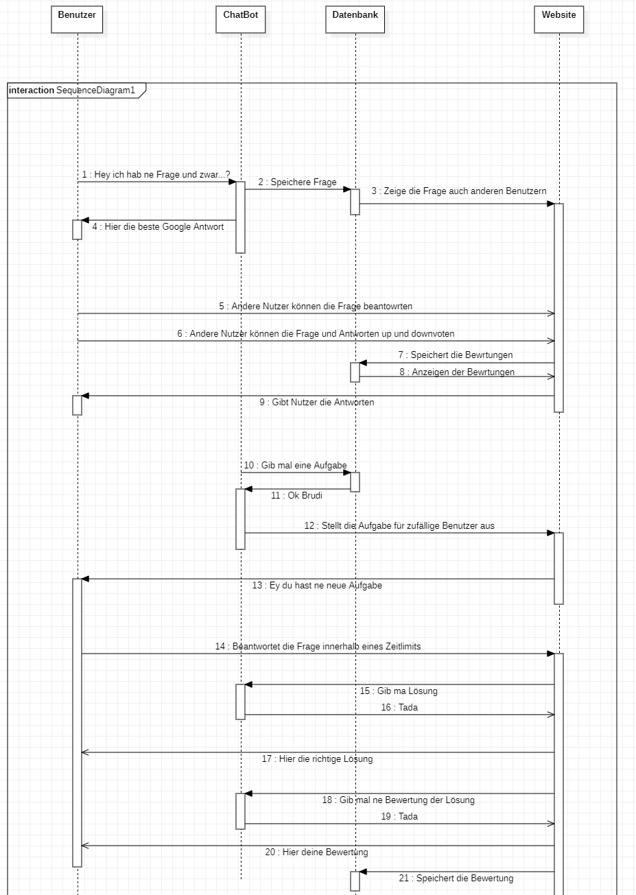
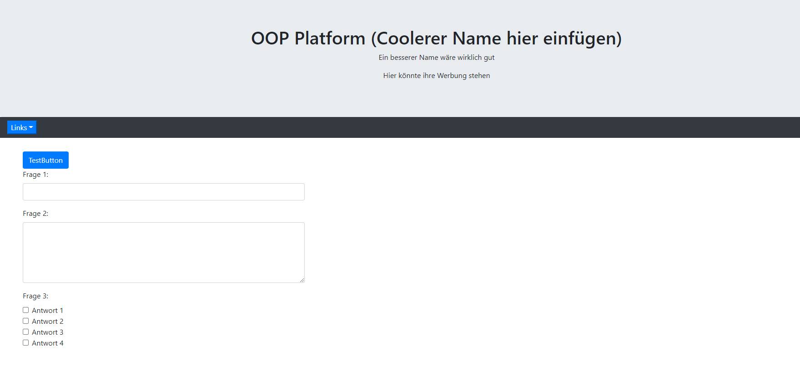

# OOP-Platform (Coolerer Name hier einfügen)

## Inhalt
- [Einleitung]()
- [Tutor-Bot]()
- [Sonstige Anforderungen]()
- [Sonstiges]()

## Einleitung
Als Studi des ersten Semseters ist meiner Meinung nach die Organisation ein großen Problem.
Durch die vielen genutzen Platform wie Moodle, Mail, Slack, Zoom, BigBlueButton etc... macht es die nicht einfacherer.
Die OOP Platform, soll eine Platform in form einer Website sein, die eine Anlauf und Sammelstelle für die Studierenden sein.   
Es soll dies nicht alles ersetzen, aber dennoch ein Sammelplatz für alles sein.
Durch das Einloggen mit CAS und eine gut und knapp strukturierte Website sollen alle Links, Informationen und Daten soll Überblick geschaffen werden.    
Durch Fragen und Antwort threads wie bei [Stackoverflow](https://stackoverflow.com/) sollen Fragen gestellt und beantwortet werden können.
Durch Upvotes guter Fragen und Antworten können diese Hervorgehoben werden und auch als FAQ wirken.

Der urspünglich als Chatbot geplante ["Tutorbot"](#tutor-bot) soll durch regelmäßige Fragen und Quizzes an zufällig ausgewählte Studis eine kontinurliche Mitarbeit erwirken und durch Auswertung der Fragen sowohl für Studirenden mit Feedback unterstützen als auch für die Lehrenden, durch eine Leistungsübersicht.    
_Somit wird jede Anfrage an den virtuellen Tutor
gleichzeitig zum Lern- und Reflexionsimpuls für andere Studierende._ 

 
Als Features sind Geplant :     

- Anmeldung über CAS
- Auch Bearbeitungszugriff für Tutoren/Dozenten Rolle
- Chat Kanäle und Privatchats wie bei Slack
- Ähnlich wie bei Stackoverflow, eine Möglichkeit Fragen zu posten und diese zu beantworten
- Der Tutor-Bot zum anregen der Studierenden siehe [hier](#tutor-bot)
- Ein Bewertungs-System für Fragen und Antworten 
- "Badges and Points"
- "Neuigkeiten"
-  FAQ's
-  Links
- Umfragen
- Profil-Seite (Vlt mit Bild)

## Tutor-Bot

Der Tutor-Bot soll eine Art "Virtueller Tutor" sein.
Durch in regelmäßigen Abständen, an zufällige Studenten und Studentinnen, nach Schwierigkeit angepasster verteilter Aufgaben/Quizzes die Studies kontinuierlich am Ball halten. (Verschiedene Frage/Quiz Möglichkeiten (Multiple Choice, Freitext ...))
Die Aufgaben sollen ein Zeitlimit haben, zu dem es Abgegeben werden soll.
Es erfolgt dann ein Feedback, durch die Rückgabe der Lösung/ Korrektur.
Features: 

- Zuteilung der Aufgaben an Studierende
- Direktes Feedback
- *Späteres Feedback durch Bewertung eines Tutors*
-  *Möglicherweise als Antwort auf Fragenthreads ein passende Antwort rausgoogeln und automatisch als erste Antwort senden*

Vor der Erstellung dieses Dokuments, habe ich an einem Sequenzdiagramm gearbeitet, welches den Fragenaustausch der Studies mit dem Tutorbot darstellen sollte.

## Sonstige Anforderungen

- Responsive, auch für mobile Nutzer
- Datenbank für das Speichern aller Beiträge, Bewertungen etc...
- "THM-Design" einer Website
- Bearbeitungsmodus toggeln für Tutoren/Dozenten
- Markdown Support für die Textfelder, *Mit Preview des Posts*

## Sonstiges

## Doku

06.11.2020
Grundlegendes Projekt erstellt, Javalin, Bootstrap & Jquery eingebunden    
Ein paar Grundlegende Fragetypen erstellt   

